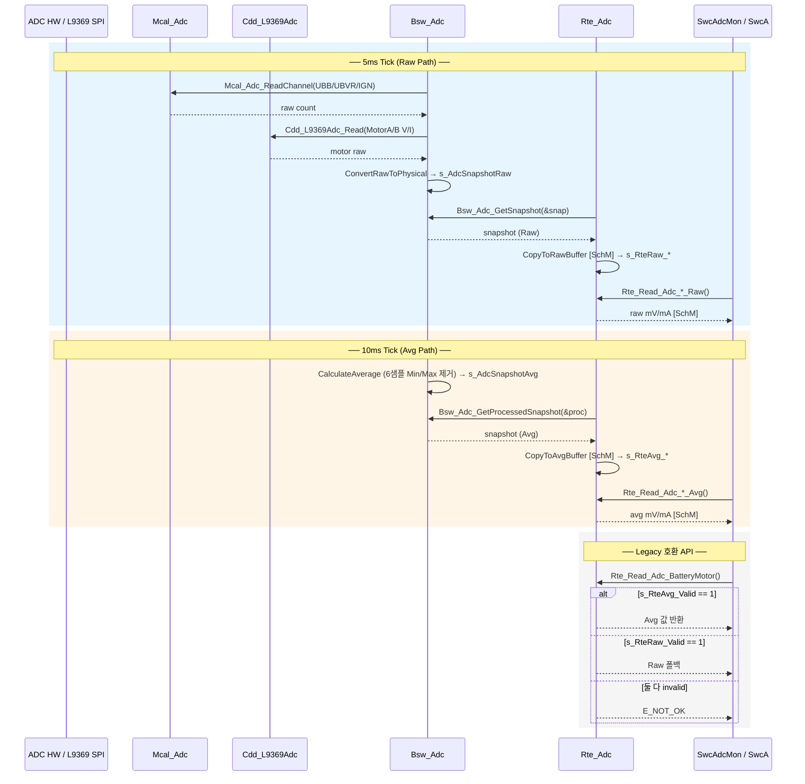

# ADC Raw/Avg RTE 분리 — 완료 보고서

> 작성: Copilot · 2026-02-09  
> 대상: MPC5604B EPB ADC AUTOSAR-like 리팩토링

---

## 1. 요구사항 충족 현황

| # | 요구사항 | 상태 | 위치 |
|---|---------|------|------|
| 1 | SR 버퍼 Raw/Avg 2세트 분리 | ✅ | `Rte_Adc.c` L5-13 (`s_RteRaw_*`) / L16-23 (`s_RteAvg_*`) |
| 2 | Publish 5ms/10ms 분리 | ✅ | `Publish_5ms` (L56) / `Publish_10ms` (L65) |
| 3 | 명시적 Raw/Avg Read API 14개 | ✅ | `_Raw` 7개 (L79-138) / `_Avg` 7개 (L143-202) |
| 4 | Legacy 호환 API 7개 (Avg→Raw 폴백) | ✅ | L207-337 |
| 5 | SwcAdcMon `_Avg` 사용 | ✅ | `SwcAdcMon.c` L36, L55-56, L66-67 |
| 선택 | SchM 원자성 (Write/Read) | ✅ | 모든 Publish 헬퍼 + Read API에 적용 |

---

## 2. 변경 파일 및 함수 목록

### 2-1. `rte/src/Rte_Adc.c` (337 lines)

| 함수 | 라인 | 역할 |
|------|------|------|
| `Rte_Adc_CopyToRawBuffer()` | L26 | Raw SR 버퍼 원자 쓰기 (static helper) |
| `Rte_Adc_CopyToAvgBuffer()` | L41 | Avg SR 버퍼 원자 쓰기 (static helper) |
| `Rte_Adc_Publish_5ms()` | L56 | `Bsw_Adc_GetSnapshot()` → Raw buffer |
| `Rte_Adc_Publish_10ms()` | L65 | `Bsw_Adc_GetProcessedSnapshot()` → Avg buffer |
| `Rte_Read_Adc_BatteryMotor_Raw()` | L79 | Raw 배터리(모터) 전압 읽기 |
| `Rte_Read_Adc_BatteryValve_Raw()` | L88 | Raw 배터리(밸브) 전압 읽기 |
| `Rte_Read_Adc_Ignition_Raw()` | L97 | Raw IGN 전압 읽기 |
| `Rte_Read_Adc_MotorA_Voltage_Raw()` | L106 | Raw 모터A 전압 읽기 |
| `Rte_Read_Adc_MotorA_Current_Raw()` | L115 | Raw 모터A 전류 읽기 |
| `Rte_Read_Adc_MotorB_Voltage_Raw()` | L124 | Raw 모터B 전압 읽기 |
| `Rte_Read_Adc_MotorB_Current_Raw()` | L133 | Raw 모터B 전류 읽기 |
| `Rte_Read_Adc_BatteryMotor_Avg()` | L143 | Avg 배터리(모터) 전압 읽기 |
| `Rte_Read_Adc_BatteryValve_Avg()` | L152 | Avg 배터리(밸브) 전압 읽기 |
| `Rte_Read_Adc_Ignition_Avg()` | L161 | Avg IGN 전압 읽기 |
| `Rte_Read_Adc_MotorA_Voltage_Avg()` | L170 | Avg 모터A 전압 읽기 |
| `Rte_Read_Adc_MotorA_Current_Avg()` | L179 | Avg 모터A 전류 읽기 |
| `Rte_Read_Adc_MotorB_Voltage_Avg()` | L188 | Avg 모터B 전압 읽기 |
| `Rte_Read_Adc_MotorB_Current_Avg()` | L197 | Avg 모터B 전류 읽기 |
| `Rte_Read_Adc_BatteryMotor()` | L207 | Legacy: Avg→Raw 폴백 |
| `Rte_Read_Adc_BatteryValve()` | L222 | Legacy: Avg→Raw 폴백 |
| `Rte_Read_Adc_Ignition()` | L237 | Legacy: Avg→Raw 폴백 |
| `Rte_Read_Adc_MotorA_Voltage()` | L252 | Legacy: Avg→Raw 폴백 |
| `Rte_Read_Adc_MotorA_Current()` | L267 | Legacy: Avg→Raw 폴백 |
| `Rte_Read_Adc_MotorB_Voltage()` | L282 | Legacy: Avg→Raw 폴백 |
| `Rte_Read_Adc_MotorB_Current()` | L297 | Legacy: Avg→Raw 폴백 |

**API 합계: 21개 Read + 2 Publish + 2 Helper = 25 함수**

### 2-2. `rte/inc/Rte_Adc.h`

- `Rte_Adc_Publish_5ms()` / `Rte_Adc_Publish_10ms()` 선언
- Legacy API 7개 선언
- `_Raw` API 7개 선언
- `_Avg` API 7개 선언

### 2-3. `swc/SwcAdcMon/src/SwcAdcMon.c`

| 호출 지점 | 변경 전 | 변경 후 |
|-----------|---------|---------|
| L36 | `Rte_Read_Adc_BatteryMotor()` | `Rte_Read_Adc_BatteryMotor_Avg()` |
| L55 | `Rte_Read_Adc_MotorA_Voltage()` | `Rte_Read_Adc_MotorA_Voltage_Avg()` |
| L56 | `Rte_Read_Adc_MotorA_Current()` | `Rte_Read_Adc_MotorA_Current_Avg()` |
| L66 | `Rte_Read_Adc_MotorB_Voltage()` | `Rte_Read_Adc_MotorB_Voltage_Avg()` |
| L67 | `Rte_Read_Adc_MotorB_Current()` | `Rte_Read_Adc_MotorB_Current_Avg()` |

---

## 3. SR 버퍼 구조

```
┌─────────────────────────────────────────────────┐
│                  Rte_Adc.c 내부                  │
├────────────────────┬────────────────────────────┤
│  Raw SR Buffer     │  Avg SR Buffer             │
│  (5ms 갱신)         │  (10ms 갱신)                │
├────────────────────┼────────────────────────────┤
│ s_RteRaw_BatteryMotor  │ s_RteAvg_BatteryMotor  │
│ s_RteRaw_BatteryValve  │ s_RteAvg_BatteryValve  │
│ s_RteRaw_Ignition      │ s_RteAvg_Ignition      │
│ s_RteRaw_MotorA_Voltage│ s_RteAvg_MotorA_Voltage│
│ s_RteRaw_MotorA_Current│ s_RteAvg_MotorA_Current│
│ s_RteRaw_MotorB_Voltage│ s_RteAvg_MotorB_Voltage│
│ s_RteRaw_MotorB_Current│ s_RteAvg_MotorB_Current│
│ s_RteRaw_Valid          │ s_RteAvg_Valid          │
└────────────────────┴────────────────────────────┘
```

---

## 4. 5ms / 10ms 데이터 흐름

### 4-1. 5ms Tick — Raw Path

```
OsTask_5ms()
  └→ Rte_Task_5ms()
       ├→ Bsw_Adc_MainFunction_5ms()
       │    ├→ Mcal_Adc_ReadChannel(UBB, UBVR, IGN)   ← MCU 10-bit ADC
       │    ├→ Cdd_L9369Adc_Read(MotorA/B V/I)        ← L9369 12-bit SPI ADC
       │    └→ ConvertRawToPhysical() → s_AdcSnapshotRaw
       │
       ├→ Rte_Adc_Publish_5ms()
       │    ├→ Bsw_Adc_GetSnapshot(&snap)              // Raw snapshot 복사
       │    └→ CopyToRawBuffer(&snap)                   // [SchM] → s_RteRaw_*
       │
       └→ SwcA_Runnable_5ms()
            └→ Rte_Read_Adc_*_Raw()                    // SWC가 Raw 값 읽기
```

### 4-2. 10ms Tick — Avg Path

```
OsTask_10ms()
  └→ Rte_Task_10ms()
       ├→ Bsw_Adc_MainFunction_10ms()
       │    └→ CalculateAverage()                       // 6샘플 Min/Max 제거
       │         → s_AdcSnapshotAvg (UBB/UBVR/IGN 평균)
       │         → Motor V/I는 Raw에서 복사
       │
       ├→ Rte_Adc_Publish_10ms()
       │    ├→ Bsw_Adc_GetProcessedSnapshot(&proc)     // Avg snapshot 복사
       │    └→ CopyToAvgBuffer(&proc)                   // [SchM] → s_RteAvg_*
       │
       ├→ SwcAdcMon_Runnable_10ms()
       │    ├→ Rte_Read_Adc_BatteryMotor_Avg()         // 배터리 진단
       │    ├→ Rte_Read_Adc_MotorA_Voltage_Avg()       // 모터A 진단
       │    ├→ Rte_Read_Adc_MotorA_Current_Avg()
       │    ├→ Rte_Read_Adc_MotorB_Voltage_Avg()       // 모터B 진단
       │    └→ Rte_Read_Adc_MotorB_Current_Avg()
       │
       └→ SwcA_Runnable_10ms()
            └→ Rte_Read_Adc_*() 또는 _Avg()            // 응용 로직
```

### 4-3. Legacy API 폴백 로직

```
Rte_Read_Adc_BatteryMotor(&val)
  │
  ├── s_RteAvg_Valid == 1 ?  →  val = s_RteAvg_BatteryMotor  →  return E_OK
  │
  ├── s_RteRaw_Valid == 1 ?  →  val = s_RteRaw_BatteryMotor  →  return E_OK
  │
  └── 둘 다 invalid          →  return E_NOT_OK
```

---

## 5. 원자성 (SchM) 적용 지점

| 구간 | 보호 대상 | 매크로 |
|------|----------|--------|
| `CopyToRawBuffer()` | 7필드 + Valid 일괄 쓰기 | `SchM_Enter/Exit_Exclusive_Area()` |
| `CopyToAvgBuffer()` | 7필드 + Valid 일괄 쓰기 | `SchM_Enter/Exit_Exclusive_Area()` |
| 모든 `_Raw` Read API | 단일 필드 읽기 | `SchM_Enter/Exit_Exclusive_Area()` |
| 모든 `_Avg` Read API | 단일 필드 읽기 | `SchM_Enter/Exit_Exclusive_Area()` |
| 모든 Legacy Read API | Avg/Raw 분기 + 읽기 | `SchM_Enter/Exit_Exclusive_Area()` |

> `SchM_Enter_Exclusive_Area()` → `APP_InterruptDisable()`  
> `SchM_Exit_Exclusive_Area()` → `APP_InterruptEnable()`  
> (정의: `config/Std_Types.h`)

---

## 6. 시퀀스 다이어그램 (Mermaid)



---

## 7. 아키텍처 계층도

```
┌──────────────────────────────────────────────────────┐
│  SWC Layer                                           │
│  ┌──────────────┐  ┌──────────────┐                  │
│  │ SwcAdcMon    │  │ SwcA_Runnable│                  │
│  │ (진단, _Avg) │  │ (응용, Legacy)│                  │
│  └──────┬───────┘  └──────┬───────┘                  │
│         │ Rte_Read_*_Avg   │ Rte_Read_*              │
├─────────┴──────────────────┴─────────────────────────┤
│  RTE Layer  (Rte_Adc.c)                              │
│  ┌─────────────────┐  ┌─────────────────┐            │
│  │ s_RteRaw_*      │  │ s_RteAvg_*      │            │
│  │ (5ms Publish)   │  │ (10ms Publish)  │            │
│  └────────┬────────┘  └────────┬────────┘            │
│           │ GetSnapshot         │ GetProcessedSnapshot│
├───────────┴─────────────────────┴────────────────────┤
│  BSW Layer  (Bsw_Adc.c)                              │
│  ┌─────────────────┐  ┌─────────────────┐            │
│  │ s_AdcSnapshotRaw│  │ s_AdcSnapshotAvg│            │
│  │ (5ms sampling)  │  │ (10ms averaging)│            │
│  └────────┬────────┘  └─────────────────┘            │
│           │                                           │
├───────────┴──────────────────────────────────────────┤
│  MCAL / CDD Layer                                    │
│  Mcal_Adc (MCU 10-bit)  │  Cdd_L9369Adc (SPI 12-bit)│
├──────────────────────────┴───────────────────────────┤
│  HW: MPC5604B ADC + L9369 Motor Driver               │
└──────────────────────────────────────────────────────┘
```
