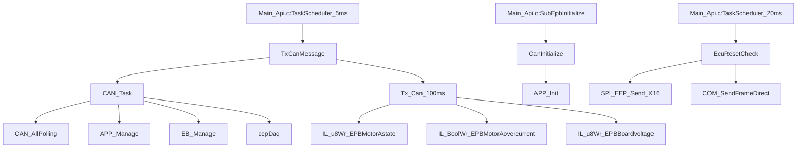

# Can_Api.c / Can_Api.h 아키텍처 분석 보고서

## 개요
본 문서는 EPB 프로젝트의 Can_Api.c/Can_Api.h 모듈에 대한 아키텍처 분석 결과를 정리한 것입니다. 리팩토링을 위한 사실 기반 분석에 중점을 두었습니다.

---

## [산출물 1] API 인벤토리

### 1.1 외부 API 함수 (Can_Api.h 선언)

| 함수명 | 입력 | 출력 | 부작용 | 전역 접근 |
|--------|------|------|--------|-----------|
| `CanInitialize()` | void | void | APP_Init() 호출, g_UDS.gnRxFrameFlag 설정 | g_UDS |
| `CAN_Task()` | void | void | CAN 폴링, 스택 관리 | 없음 |
| `TxCanMessage()` | void | void | CAN_Task() + Tx_Can_100ms() 호출 | 없음 |
| `EcuResetCheck()` | void | void | EEPROM 쓰기, 시스템 리셋 | g_UDS, EEPROM |
| `DTC_CAN_Missing()` | uint8 can_num, uint8 fault_bit, uint8 dtcIdx | uint8 | DTC 상태 설정 | DTC_CAN_Status[] |
| `DTC_CAN_MessageFailure()` | uint8 can_num, uint8 fault_bit, uint8 dtcIdx | uint8 | DTC 상태 설정 | DTC_CAN_Status[] |
| `DTC_CAN_InvalidData()` | uint8 can_num, uint8 fault_bit, uint8 dtcIdx | uint8 | DTC 상태 설정 | DTC_CAN_Status[] |
| `DTC_CAN_Checksum()` | uint8 can_num, uint8 fault_bit, uint8 dtcIdx | uint8 | DTC 상태 설정 | DTC_CAN_Status[] |
| `DTC_CAN_AliveCounter()` | uint8 can_num, uint8 fault_bit, uint8 dtcIdx | uint8 | DTC 상태 설정 | DTC_CAN_Status[] |

### 1.2 내부 static 함수 (Can_Api.c 구현)

| 함수명 | 역할 |
|--------|------|
| `iEHB_Message()` | IEHB 메시지 수신 상태 관리 및 타임아웃 처리 |
| `Tx_Can_100ms()` | 100ms 주기 CAN 송신 데이터 설정 (모터 상태, 진단 정보) |

### 1.3 ISR/Callback 함수

- **없음**: Can_Api.c에는 직접적인 ISR 함수가 없음
- CAN 수신은 EB 스택 내부에서 처리되며, `CAN_AllPolling()`을 통해 폴링 방식으로 처리

---

## [산출물 2] 호출관계 (콜 그래프)

### 2.1 호출자 → Can API

```
Main_Api.c:SubEpbInitialize() → CanInitialize()
Main_Api.c:TaskScheduler_5ms() → TxCanMessage() (SystemDown/Normal 상태)
Main_Api.c:TaskScheduler_20ms() → EcuResetCheck()
```

### 2.2 CAN Tx 경로

```
TaskScheduler_5ms() → TxCanMessage() → CAN_Task() → EB_Manage()
                                   → Tx_Can_100ms() → IL_u8Wr_*() → EB Stack
```

### 2.3 CAN Rx 경로

```
TaskScheduler_5ms() → TxCanMessage() → CAN_Task() → CAN_AllPolling() → EB Stack
                                                  → APP_Manage()
```

### 2.4 Mermaid 콜 그래프



---

## [산출물 3] 상태/버퍼 분석

### 3.1 전역변수/정적변수 목록

| 변수명 | 타입 | 용도 | ISR 공유 위험 |
|--------|------|------|---------------|
| `g_CAN` | Can_t | CAN 수신 상태, 카운터 | **위험**: fbRxInd_IEHB, Cnt_Fail_IEHB |
| `g_UDS` | Uds_t | UDS 진단 상태, 리셋 관리 | **위험**: 다수 플래그 비트필드 |
| `DTC_CAN_Status[15]` | Status_of_CAN_DTC | CAN DTC 상태 배열 | **위험**: DTC 함수에서 접근 |
| `DTC_Status[DEM_DTC_NUMBER]` | Status_of_DTC | 전체 DTC 상태 | **위험**: 진단 함수에서 접근 |
| `RxBuffer[10]` | Data_Packet (static) | CAN 수신 버퍼 | 낮음: static 선언 |
| `stSaveDTC` | SaveDtcType | DTC 저장 요청 관리 | **위험**: EEPROM 저장 시 |
| `g_BOARD` | Board_t | 보드 상태 관리 | 낮음: 단순 플래그 |

### 3.2 경합 위험 분석

- **높은 위험**: `g_CAN.fbRxInd_IEHB` - ISR에서 설정, Task에서 읽기/클리어
- **높은 위험**: `g_UDS` 비트필드들 - 원자성 보장 필요
- **중간 위험**: DTC 상태 배열들 - 다중 진단 함수에서 동시 접근 가능

---

## [산출물 4] 레지스터 접근 / HW 의존점

### 4.1 직접 레지스터 접근

- **없음**: Can_Api.c에는 직접적인 레지스터 접근 코드 없음
- 모든 CAN 하드웨어 접근은 EB 스택을 통해 추상화됨

### 4.2 MCAL 후보

- `APP_Init()` - EB 스택 내부에서 CAN 컨트롤러 초기화 (MCAL 후보)
- `CAN_AllPolling()` - EB 스택 내부에서 CAN 레지스터 폴링 (MCAL 후보)

---

## [산출물 5] CAN 메시지 매핑

### 5.1 송신 메시지 (Tx_Can_100ms 기준)

| 신호명 | 데이터 소스 | 변환 | 용도 |
|--------|-------------|------|------|
| EPBMotorAstate | g_L9369_Status.EpbStatusLeft | 직접 | 좌측 모터 상태 |
| EPBMotorAindication | g_L9369_Status.fMaxApplied_Left | 0x01→0x1, else→0x0 | 좌측 적용 표시 |
| EPBMotorBstate | g_L9369_Status.EpbStatusRight | 직접 | 우측 모터 상태 |
| EPBMotorBindication | g_L9369_Status.fMaxApplied_Right | 0x01→0x1, else→0x0 | 우측 적용 표시 |
| EPBMotorAovercurrent | DiagInput.D11_MtrCurOvA | 직접 | 좌측 과전류 |
| EPBMotorAundercurrent | DiagInput.D11_MtrCurUvA | 직접 | 좌측 저전류 |
| EPBMotorBovercurrent | DiagInput.D11_MtrCurOvB | 직접 | 우측 과전류 |
| EPBMotorBundercurrent | DiagInput.D11_MtrCurUvB | 직접 | 우측 저전류 |
| EPBRxError | ElectronicParkBrake_Y.SSMOutputCAN.EPB_FailureSts | 직접 | EPB 실패 상태 |
| EPBBoardvoltage | g_ADC.Physical.Power.UBB | /100.0 → uint8 | 보드 전압 |
| EPBMotorAcurrent | g_ADC.Physical.Motor.MOTORA_CUR | /100.0 → uint16 | 좌측 모터 전류 |
| EPBMotorAvoltage | g_ADC.Physical.Motor.MOTORA | /100.0 → uint8 | 좌측 모터 전압 |
| EPBMotorBcurrent | g_ADC.Physical.Motor.MOTORB_CUR | /100.0 → uint16 | 우측 모터 전류 |
| EPBMotorBvoltage | g_ADC.Physical.Motor.MOTORB | /100.0 → uint8 | 우측 모터 전압 |

### 5.2 수신 메시지

| 메시지 | 처리 함수 | 상태 관리 |
|--------|-----------|-----------|
| IEHB | iEHB_Message() | g_CAN.fbRxInd_IEHB, g_CAN.Cnt_Fail_IEHB |

### 5.3 UDS/진단 메시지 (별도 섹션)

| 메시지 ID | 용도 | 처리 위치 |
|-----------|------|-----------|
| Diag_From_EPB1R | UDS 응답 | EcuResetCheck() |
| COM_FRAME_IDX_Diag_From_EPB1R | 진단 응답 프레임 | COM_SendFrameDirect() |

### 5.4 DTC 정의

| DTC 타입 | 값 | 설명 |
|----------|----|----- |
| DTC_IEHB | 0U | IEHB 메시지 관련 DTC |
| MissingMessage | 0U | 메시지 누락 |
| MessageFailure | 1U | 메시지 실패 |
| InvalidData | 2U | 롤링 카운터 오류 |
| InvalidChecksum | 3U | 체크섬 오류 |
| InvalidAlive | 4U | Alive 카운터 오류 |

---

## [산출물 6] 리팩토링 준비 결론

### 6.1 AUTOSAR-like 레이어링 경계 후보

#### MCAL Layer 후보
- EB 스택 내부 함수들 (`APP_Init`, `CAN_AllPolling`, `EB_Manage`)
- 실제 CAN 컨트롤러 레지스터 접근 부분

#### BSW Layer 후보
- `g_CAN`, `g_UDS` 전역변수 접근 래퍼 함수들
- IL_* 함수들 (CAN 신호 쓰기 서비스)
- DTC 상태 Get/Set 서비스

#### FS Layer 후보
- IEHB 메시지 타임아웃 판단 로직 (`Cnt_Fail_IEHB > 9`)
- ECU 리셋 조건 판단 로직 (`g_UDS.fECU_Reset_Bit` 체크)
- DTC 설정/해제 결정 로직

#### ASW Layer 후보
- `TxCanMessage()`, `Tx_Can_100ms()` - 주기적 송신 오케스트레이션
- `EcuResetCheck()` - 리셋 시퀀스 실행
- `iEHB_Message()` - 메시지 처리 실행

### 6.2 분리 필요 플래그

#### ISR 컨텍스트 분리 필요
- **없음**: 현재 Can_Api.c에는 ISR에서 실행되는 로직 없음
- EB 스택 내부 ISR은 별도 분석 필요

#### 경합 조건 해결 필요
- **높음**: `g_CAN.fbRxInd_IEHB` 원자성 보장
- **높음**: `g_UDS` 비트필드 접근 보호
- **중간**: DTC 배열 동시 접근 보호

#### 복잡도 분리 필요
- **높음**: `EcuResetCheck()` - 상태머신 + EEPROM + 리셋 로직 혼재
- **중간**: `Tx_Can_100ms()` - 다중 데이터 소스 + 변환 로직
- **낮음**: `iEHB_Message()` - 단순 타임아웃 로직

---

## 분석 결론

### 주요 발견사항
1. **EB 스택 의존성**: 모든 CAN 하드웨어 접근이 EB 스택을 통해 추상화됨
2. **복합 책임**: Can_Api.c가 CAN 통신 + UDS 진단 + ECU 리셋을 모두 담당
3. **경합 조건 위험**: 다수의 전역변수가 ISR과 Task 간 공유될 가능성
4. **레이어 혼재**: 하드웨어 추상화부터 애플리케이션 로직까지 한 파일에 존재

### 리팩토링 우선순위
1. **높음**: 경합 조건 해결 (원자성 보장)
2. **높음**: EcuResetCheck() 복잡도 분리
3. **중간**: BSW/FS/ASW 레이어 분리
4. **낮음**: DTC 관리 로직 정리

---

**분석 일자**: 2026-01-28  
**분석자**: Kiro AI Assistant  
**대상 파일**: EPB/Application/Diagnostics/Can_Api.c, Can_Api.h