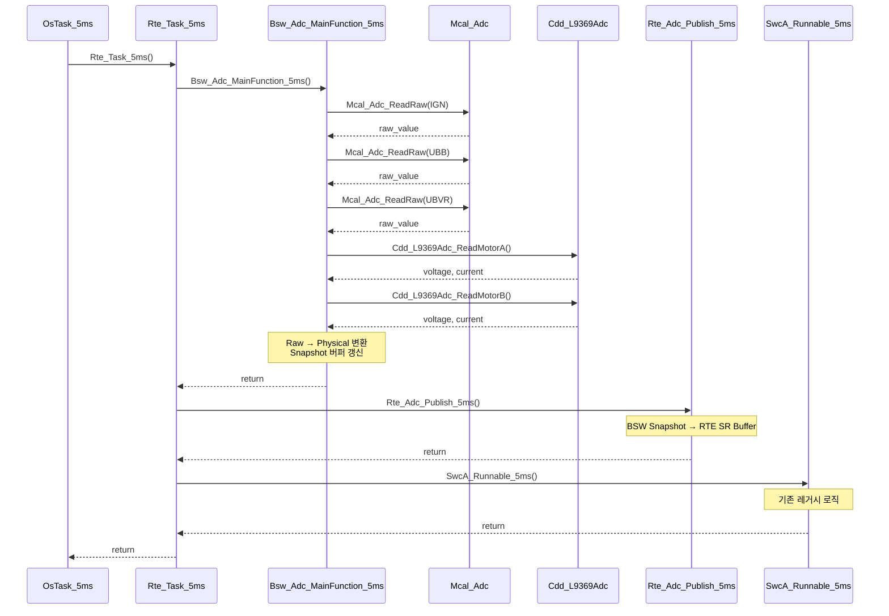
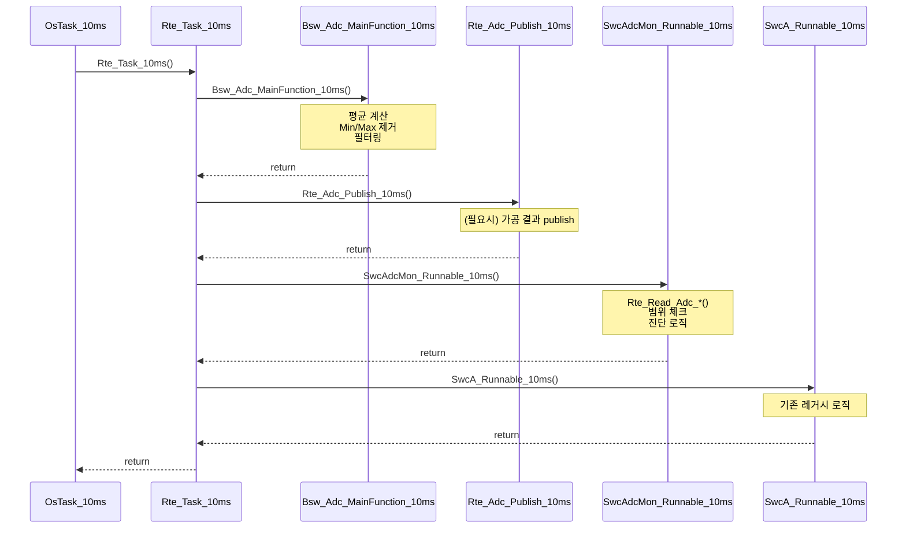

# ADC AUTOSAR-like Architecture

## 1. 계층별 책임 (Responsibility)

### MCAL Layer (mcal/adc/)
**책임:**
- MCU ADC 하드웨어 레지스터 직접 제어
- Raw ADC 값 읽기 (10-bit)
- 변환 완료 대기 및 타임아웃 처리

**API:**
```c
void Mcal_Adc_Init(void);
uint16_t Mcal_Adc_ReadRaw(uint8_t channelId);
```

**캡슐화:**
- HW 레지스터 접근은 .c 파일 내부에서만
- 외부 노출: Init, ReadRaw만

---

### CDD Layer (cdd/l9369/)
**책임:**
- L9369 모터 드라이버 IC의 ADC 데이터 읽기
- SPI 통신을 통한 전압/전류 센싱
- 12-bit ADC 결과를 물리값으로 변환

**API:**
```c
void Cdd_L9369Adc_Init(void);
void Cdd_L9369Adc_ReadMotorA(uint16_t* voltage_mV, int16_t* current_mA);
void Cdd_L9369Adc_ReadMotorB(uint16_t* voltage_mV, int16_t* current_mA);
```

**캡슐화:**
- L9369 레지스터 구조체는 .c 내부 static
- 외부 노출: Init, ReadMotorA/B만

---

### BSW Layer (bsw/adc/)
**책임:**
- MCAL/CDD 호출하여 모든 채널 샘플링
- Raw → Physical 변환 (전압 분배 회로 적용)
- Snapshot 버퍼 관리 (최신 물리값 저장)
- 10ms 가공 (평균, Min/Max 제거)

**API:**
```c
void Bsw_Adc_Init(void);
void Bsw_Adc_MainFunction_5ms(void);
void Bsw_Adc_MainFunction_10ms(void);
Std_ReturnType Bsw_Adc_GetSnapshot(Bsw_Adc_Snapshot_t* snapshot);
```

**캡슐화:**
- Snapshot 버퍼는 .c 내부 static
- RTE include 금지 (BSW는 RTE를 모름)
- 외부 노출: Init, MainFunction, GetSnapshot만

---

### RTE Layer (rte/adc/)
**책임:**
- BSW Snapshot을 RTE SR Buffer로 복사
- SWC에게 Rte_Read_* 인터페이스 제공
- 라우팅만 수행 (정책/필터 로직 없음)

**API:**
```c
/* RTE Internal (SWC에서 호출 금지) */
void Rte_Adc_Publish_5ms(void);
void Rte_Adc_Publish_10ms(void);

/* SWC Interface */
Std_ReturnType Rte_Read_Adc_BatteryMotor(uint16_t* value);
Std_ReturnType Rte_Read_Adc_Ignition(uint16_t* value);
Std_ReturnType Rte_Read_Adc_MotorA_Voltage(uint16_t* value);
Std_ReturnType Rte_Read_Adc_MotorA_Current(int16_t* value);
Std_ReturnType Rte_Read_Adc_MotorB_Voltage(uint16_t* value);
Std_ReturnType Rte_Read_Adc_MotorB_Current(int16_t* value);
```

**캡슐화:**
- SR Buffer는 .c 내부 static
- BSW 헤더만 include (Bsw_Adc.h)

---

### SWC Layer (swc/SwcAdcMon/)
**책임:**
- RTE를 통해 ADC 값 읽기
- 범위 체크, 진단 로직 (데모 수준)
- 제어 로직 (최소 구현)

**API:**
```c
void SwcAdcMon_Init(void);
void SwcAdcMon_Runnable_10ms(void);
```

**캡슐화:**
- RTE 헤더만 include (Rte_Adc.h)
- BSW/MCAL/CDD include 절대 금지

---

## 2. 시퀀스 다이어그램

### 5ms 샘플링 시퀀스



### 10ms 가공 시퀀스



---

## 3. 데이터 흐름

```
[HW ADC] → [MCAL] → [BSW Snapshot] → [RTE SR Buffer] → [SWC]
                ↑
         [L9369 IC] → [CDD]
```

**5ms 주기:**
- HW 샘플링 → Snapshot 갱신 → RTE Buffer 갱신

**10ms 주기:**
- Snapshot 기반 가공 → (필요시) RTE Buffer 갱신

---

## 4. 캡슐화 규칙

### Static 컨텍스트 (외부 노출 금지)

| 계층 | Static 변수/함수 |
|------|------------------|
| MCAL | ADC 레지스터 포인터, 타임아웃 카운터 |
| CDD | L9369 레지스터 구조체, SPI 버퍼 |
| BSW | Snapshot 버퍼, 평균 계산 버퍼, 내부 변환 함수 |
| RTE | SR Buffer (각 Signal별) |

### 외부 노출 API

| 계층 | 외부 노출 함수 |
|------|----------------|
| MCAL | Mcal_Adc_Init(), Mcal_Adc_ReadRaw() |
| CDD | Cdd_L9369Adc_Init(), Cdd_L9369Adc_ReadMotorA/B() |
| BSW | Bsw_Adc_Init(), Bsw_Adc_MainFunction_5/10ms(), Bsw_Adc_GetSnapshot() |
| RTE | Rte_Adc_Publish_5/10ms(), Rte_Read_Adc_*() |
| SWC | SwcAdcMon_Init(), SwcAdcMon_Runnable_10ms() |

---

## 5. Include 규칙

```
SWC:  #include "Rte_Adc.h"  (RTE만)
RTE:  #include "Bsw_Adc.h"  (BSW만)
BSW:  #include "Mcal_Adc.h", "Cdd_L9369Adc.h"  (MCAL/CDD만)
MCAL: #include <stdint.h>  (표준 라이브러리만)
CDD:  #include <stdint.h>  (표준 라이브러리만)
```

**절대 금지:**
- SWC에서 BSW/MCAL/CDD include
- BSW에서 RTE include
- RTE에서 SWC include

---

## 6. 레거시 코드와의 공존

### 병행 실행 전략
- 기존 `CheckAdcStatus()` (5ms) 유지
- 새로운 `Bsw_Adc_MainFunction_5ms()` 병행 실행
- 기존 `g_ADC` 전역 변수 유지 (레거시 코드용)
- 새로운 Snapshot/SR Buffer 독립 운영

### 점진적 전환 계획
1. **Phase 1 (현재)**: 새 구조 구축, 레거시와 병행
2. **Phase 2**: 레거시 코드를 새 RTE API로 점진 전환
3. **Phase 3**: 레거시 함수 제거, 새 구조로 완전 전환

---

## 7. 성능 고려사항

### 5ms Task 실행 시간
- MCAL ADC 읽기: ~100us (변환 대기 포함)
- CDD L9369 읽기: ~200us (SPI 통신)
- 변환 및 Snapshot 갱신: ~50us
- **총 예상 시간: ~350us**

### 10ms Task 실행 시간
- 평균 계산: ~50us
- Min/Max 제거: ~30us
- **총 예상 시간: ~80us**

### 메모리 사용량
- BSW Snapshot: ~16 bytes
- RTE SR Buffer: ~16 bytes
- 평균 계산 버퍼: ~96 bytes (6샘플 × 7채널 × 2bytes)
- **총 예상 메모리: ~128 bytes**
